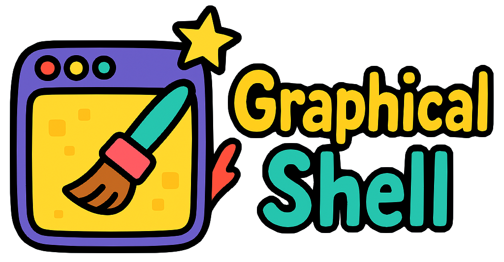
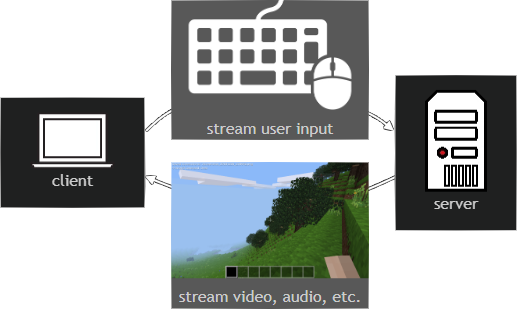

  

	
    
    
	 
    
	
	&nbsp;
	
	

 

## What is **Graphical Shell**?

It is a versatile framework designed to empower developers and enthusiasts to create custom graphical server interfaces, applications, services and experiences.
Whether you're building a personal server, a graphical Bulletin Board System (BBS), or exploring new interactive experiences, Graphical Shell provides the tools to bring your ideas to life.

It shippes with a SSH-like client application (`gsh`) that allows users to connect to a server and interact with it through a graphical interface.
All rendering and graphical elements are handled by the server, while the client seamlessly streams user interactions and input to the server for processing.

  <table>
	<tr>
	  <td align="center">
	  	<h3>👉 Download <a href="client/README.md"><code>gsh</code></a> 👈</h3>
	  	Quickly install the latest <b>client</b>!
	  </td>
	</tr>
	</table>

## Features

- **Customizable**: Create your own interactive graphical experiences using [`libgsh`](libgsh/README.md).
- **Cross-Platform**: Lightweight client application on `Linux`, `macOS`, and `Windows`.
- **Security**: `TLS 1.3` encryption ensures secure communication.
- **Authentication**: Supports `password` and `public key` authentication, for secure access to private servers.

### What are you gonna build? ✨

- ### [Get Started](libgsh/README.md) 🔨

  - [`gsh` Client Installation](client/README.md#quick-install) 🛠️
  - [`libgsh` Quickstart](libgsh/README.md#quick-install) 🚀
  - [`libgsh` API Reference](https://docs.rs/libgsh/latest/libgsh/) 📖

- ### [Examples](examples/) 🎓

- ### [Community](COMMUNITY.md) 👪

&nbsp;
