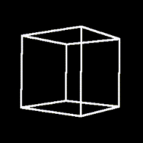
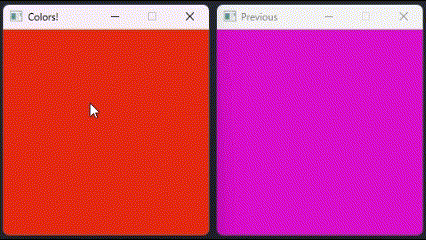

# 🎓 Example Gallery

This directory showcases example GSH (Graphical Shell) services built with [`libgsh`](https://github.com/gsh-shell/libgsh). Each service demonstrates a unique rendering pipeline powered by Rust and pixel-level control over the display.

 

## Authentication

|                       Title                        | Description                                                                                                                                                                                            |
| :------------------------------------------------: | ------------------------------------------------------------------------------------------------------------------------------------------------------------------------------------------------------ |
|  <h3><a href="password_auth/">🔑 Password</a></h3>  | A simple password authentication example. It demonstrates how to use the `gsh` library to create a basic authentication system with a password prompt.                                                 |
| <h3><a href="signature_auth/">🔑 Signature</a></h3> | A more advanced authentication example that uses a digital signature to verify the identity of the user. It demonstrates how to use cryptographic signatures to authenticate users in a secure manner. |

 

## Rendering

|                                                        Title                                                         | Description                                                                                                                                                                                                                                                                                                                                                                          |
| :------------------------------------------------------------------------------------------------------------------: | ------------------------------------------------------------------------------------------------------------------------------------------------------------------------------------------------------------------------------------------------------------------------------------------------------------------------------------------------------------------------------------ |
|          <h3><a href="cube/">🧊 Spinning 3D Cube</a></h3>            | A real-time software-rendered 3D cube that rotates smoothly and responds to window resizing. This example highlights:   <ul><li>Matrix-based 3D transformations (<code>vek</code>)</li><li>Dynamic perspective projection</li><li>Framebuffer rendering</li><li>Fullscreen window with <code>resize_frame = true</code></li><li>Continuous rotation without user input</li></ul> |
|     <h3><a href="colors/">🎨 Random Color Generator</a></h3>       | A playful example showing how to generate and render random colors on user interaction. Two windows display the current and previous colors.   <ul><li>User-driven input handling</li><li>Fixed-size dual windows</li><li>Efficient RGBA buffer construction</li></ul>                                                                                                           |
| <h3><a href="liquid_sim/">🌊 Liquid Simulation</a></h3> | A high-performance particle-based fluid simulation demonstrating the complete GSH rendering pipeline. Features 2048 particles with gravity, inter-particle forces, and wall collisions.   <ul><li>CPU-parallel simulation (<code>rayon</code>)</li><li>Velocity-based coloring</li><li>Zstd compression</li><li>Resizable window</li><li>60 FPS rendering</li></ul> |
| <h3><a href="remote_desktop/">🖥️ Remote Desktop</a></h3>  | A lightweight RDP-style server that captures the primary monitor, compresses the raw RGBA frame on-the-fly with Zstandard (Zstd), and streams the result to any GSH client. This example showcases:   <ul><li>Cross-platform capture</li><li>Adaptive frame rate</li><li>Loss-less Zstd compression</li><li>Multi-core scaling</li></ul>                                         |
