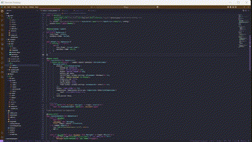

# 🖥️ Remote Desktop

## Overview

This example shows a **Graphical Shell (GSH) service that turns your machine into a lightweight RDP‑style server** in `< 400 lines` of fully cross‑platform Rust.
Each tick it captures the primary monitor with **[`xcap`](https://crates.io/crates/xcap)**, compresses the raw RGBA frame on‑the‑fly with **Zstandard (Zstd)**, and streams the result to any GSH client.
Using the Rust `zstd` crate — with its multi‑threaded **`zstdmt`** backend — the encoder routinely keeps up with 60 fps 1080 p streams while cutting bandwidth in half or better.

## Features

- **Cross‑platform capture**: Works out‑of‑the‑box on Windows ≥ 8.1, macOS ≥ 10.13, X11 and Wayland.
- **Adaptive frame rate**: Simple FPS limiter keeps CPU usage in check (default 60 fps, configurable).
- **Loss‑less Zstd compression**: Cuts frame size by ~93.52% at level `3` with sub‑millisecond latency.
- **Multi‑core scaling** via the crate’s `zstdmt` feature (automatic worker pool)
- **Better ratio than LZ4** at modest extra CPU cost, making it a sweet spot for desktop sharing

## Technical Details

| Area            | Implementation                                                                                                                                                                                                                                                                                                                               |
| --------------- | -------------------------------------------------------------------------------------------------------------------------------------------------------------------------------------------------------------------------------------------------------------------------------------------------------------------------------------------- |
| **Capture**     | `xcap::Monitor::capture_image()` → `image::DynamicImage` (RGBA 8 bpp)                                                                                                                                                                                                                                                                        |
| **Compression** | `zstd::stream::Encoder` (level ‑1 … 3, `zstdmt` for multi‑core). `EncoderOptions::multithread(nb_workers)` distributes blocks across cores for linear speed‑ups until memory bandwidth saturates. Default **level 0** trades \~2 × reduction for \~550 MB/s encode; levels ‑3…‑1 push >800 MB/s with \~1.7 × reduction, ideal for 4‑K/60 Hz. |
| **Protocol**    | `FrameFormat::Rgba`, length‑prefixed binary packets                                                                                                                                                                                                                                                                                          |
| **Window**      | Opened once with monitor resolution; client can request resize                                                                                                                                                                                                                                                                               |
| **Timing**      | `std::time::Instant`‑based FPS limiter in `on_tick`                                                                                                                                                                                                                                                                                          |
| **Async**       | All network I/O via `tokio`, compression via `async‑compression` when the `async` feature is enabled. `async-compression::tokio::write::ZstdEncoder` wraps any `TcpStream`/`WebSocket` so the compressor runs in the same task that transmits packets.                                                                                       |

With these tweaks the Zstd‑compressed stream typically slashes raw RGBA bandwidth by **45–65 %** while adding well under **1 ms** of latency on modern desktop CPUs, making it an excellent middle ground before stepping up to full hardware video encoding.
